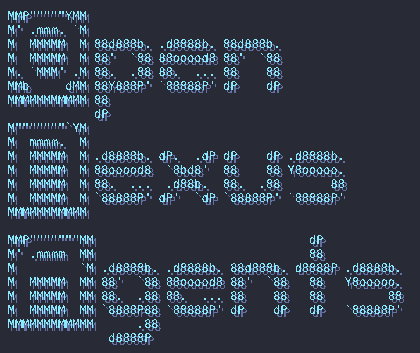

<p align="center">
  
</p>

<h3 align="center">OpenNexus agents</h3>
<p align="center"> (renamed from openjarvis)</p>


<p align="center">Orchestration, coding, planning and brainstorming agents with a pack of subagents, skills and commands</p>
<p align="center">version 0.1.0</p>

<p align="center">
<a href="https://opensource.org/licenses/MIT">
    
</a>
<p>

# OpenNexus Agents Repository

A comprehensive collection of AI agents, subagents, commands, and skills for the OpenCode AI coding assistant. This repository provides a modular, extensible framework for intelligent code assistance, from implementation and refactoring to planning and orchestration.

**What's included:**
- **4 Primary Agents** - User-facing agents for orchestration, coding, brainstorming, and planning
- **13 Subagents** - Specialized workers for exploration, review, testing, implementation, and more
- **11 Commands** - Custom workflows for checkpoints, planning, documentation, and automation
- **4 Skills** - Reusable instruction modules for task management, git operations, coding standards, and iterative retrieval

## Pre-installation Requirements

Before installing, ensure you have the following dependencies:

- **Bash** 3.2 or higher
- **jq** - Command-line JSON processor ([download here](https://jqlang.github.io/jq/download/))
- **OpenCode** - The OpenCode AI coding assistant ([documentation](https://opencode.dev))

## Installation

### Quick Install

For quick setup and CI/automation, use this one-liner to install all components non-interactively:

```bash
curl -fsSL https://raw.githubusercontent.com/sina96/OpenNexus-Agents/main/install.sh | bash -s -- --non-interactive-all
```

> **Note:** This installs agents, subagents, commands, skills, and all other components without prompts. It also creates a local `opencode.jsonc` config file with `opennexus` as the default agent. Suitable for quick setup and CI/automation. By default, non-interactive installation installs to the local project directory (`current-directory/.opencode`).

### Non-Interactive Install Options

For automated environments or CI pipelines, the following non-interactive flags are available:

- **`--non-interactive-agents`** - Install agents and subagents only
- **`--non-interactive-all`** - Install agents, subagents, and other components (commands, skills, tools, plugins)
- **`--non-interactive`** - Alias for `--non-interactive-all`

**Usage examples:**

```bash
# Install agents only
./install.sh --non-interactive-agents

# Install all components
./install.sh --non-interactive-all
```

> **Note:** Non-interactive mode automatically skips interactive post-install steps (provider selection, MCP detection, model recommendations, gitignore updates). However, it still creates the `opencode.jsonc` config file. These interactive steps only run in interactive mode.

### Installation Location Options

Control where agents and components are installed:

- **`--install-location local`** - Install to project directory (default: `current-directory/.opencode`)
- **`--install-location global`** - Install to user-wide directory (`~/.config/opencode`)
- **`--install-dir <path>`** - Install to custom directory (overrides `--install-location`)
- **`--into <dir>`** - Set project root for .gitignore and opencode.jsonc updates (default: current directory)

**Usage examples:**

```bash
# Install globally for all projects
./install.sh --non-interactive-all --install-location global

# Install to custom directory
./install.sh --non-interactive-all --install-dir ~/my-agents

# Install locally with custom project root
./install.sh --non-interactive-all --into /path/to/project
```

### Interactive Install (Local Development)

For local development with interactive prompts:

```bash
./install.sh
```

The installation script will copy all components from `core/` into `.opencode/` in your project directory.

## Primary Agents

Primary agents are user-facing and designed to start conversations. They handle high-level tasks and delegate to specialized subagents when needed.

| Name | Temperature | Description |
|------|-------------|-------------|
| **OpenNexus** | 0.2 | Orchestrator that delegates to specialists for optimal quality/speed/cost |
| **OpenCoder** | 0.2 | Coding agent for implementation and refactors |
| **OpenBrainstorm** | 0.8 | Brainstorming creative agent for generating ideas, asking clarifying questions, and exploring options |
| **OpenPlanner** | 0.1 | Planning agent for analysis, design, and step-by-step plans |

## Subagents

Subagents are specialized workers delegated by primary agents. They focus on specific tasks and provide expert-level assistance in their domain.

| Name | Description |
|------|-------------|
| **Context Manager** | Produces compact summaries, context pruning suggestions, and handoff notes |
| **Deep Explorer** | Read-only codebase explorer for locating files, flows, and dependencies |
| **Designer** | UI/UX design and frontend polish |
| **Doc Updater** | Updates project documentation to match code and behavior |
| **Junior Coder** | Implements small, well-scoped changes safely (low-risk edits only) |
| **Markdown Handler** | Creates or updates markdown files and validates frontmatter YAML |
| **Refactor Cleaner** | Refactoring specialist for dead code removal, duplication cleanup, and dependency pruning |
| **Researcher** | Web research specialist for official docs, GitHub examples, and external references |
| **Reviewer** | Read-only code reviewer focused on correctness, security, and maintainability |
| **Requirement Manager** | Creates clear product requirements and tickets for Jira/Trello/GitHub Issues (scrum/kanban) |
| **Senior Coder** | Handles complex refactors, multi-file changes, and architecture-level implementation |
| **Task Manager** | Breaks work into executable steps with sequencing, risks, and acceptance criteria |
| **Tester** | Runs tests/linters/builds and triages failures into actionable fixes |

## Commands

Custom commands extend OpenCode functionality with specialized workflows and automation.

| Name | Description |
|------|-------------|
| **Checkpoint** | Save verification state and progress checkpoint |
| **Implement Plan** | Implement a saved plan from .opencode/plans/ |
| **Update Init** | Scan the project and update AGENTS.md for OpenCode |
| **Refactor Clean** | Remove dead code and consolidate duplicates |
| **Code Review** | Review code for quality, security, and maintainability |
| **Create Jira Ticket** | Create a Jira-style ticket from user requirements with scope and issues |
| **Orchestrate** | Orchestrate multiple agents for complex tasks |
| **Update Docs** | Update documentation for recent changes |
| **Format Files** | Format files using available OpenCode formatters |
| **Learn** | Extract patterns and learnings from current session |
| **Add Skill** | Create a new skill doc under .opencode/skills/ |

## Skills

Skills are reusable instruction modules that provide domain-specific workflows and can be loaded by agents as needed.

| Name | Description |
|------|-------------|
| **Task Management** | Task management CLI for tracking and managing feature subtasks with status, dependencies, and validation |
| **Git Master** | MUST USE for ANY git operations. Atomic commits, rebase/squash, history search (blame, bisect, log -S). |
| **Coding Standards** | Universal coding standards, best practices, and patterns for TypeScript, JavaScript, React, and Node.js development. |
| **Iterative Retrieval** | Pattern for progressively refining context retrieval to solve the subagent context problem |

## Repository Structure

```
OpenNexus-Agents/
├── core/
│   ├── agents/
│   │   ├── primary/      # Primary agents (OpenCoder, OpenBrainstorm, etc.)
│   │   └── subagents/    # Subagents (deep-explorer, reviewer, tester, etc.)
│   ├── commands/         # Custom commands (installed into .opencode/commands)
│   └── skills/           # Reusable skill modules (installed into .opencode/skills)
├── .opencode/            # Installed agents (auto-generated, gitignored)
├── install.sh            # Installation script
├── registry.jsonc        # Component registry (JSONC with comments allowed)
├── opencode.jsonc        # Project config (sets default_agent to opennexus)
└── AGENTS.md             # Agent documentation and guidelines
```

## Usage

After installation, invoke agents using the OpenCode CLI:

```bash
# Start a conversation with a primary agent
opencode chat @OpenCoder "Implement user authentication"

# Use a command
opencode run checkpoint

# Delegate to a subagent (from within an agent conversation)
@subagent/deep-explorer "Find all API endpoints"
```

## Customization

### Customizing Agent Definitions

Agents are defined in `core/agents/primary/` (for primary agents) and `core/agents/subagents/` (for subagents). Each agent is a Markdown file with YAML frontmatter that controls its behavior, permissions, and capabilities.

After editing any agent definition, you must run the installation script to sync your changes to `.opencode/`:

```bash
./install.sh
```

### Assigning Specific Models

You can assign specific AI models to individual agents by adding a `model` field to their YAML frontmatter. This allows you to optimize for cost, performance, or specific capabilities based on each agent's role.

Model IDs follow the format: `provider/model-id`

**Example providers:**
- `anthropic/claude-sonnet-4-5` (Anthropic)
- `openai/gpt-4o-mini` (OpenAI)
- `google/gemini-2.5-flash` (Google)
- `opencode/minimax-m2.1` (OpenCode)

### Example: Cost-Optimized Junior Coder

For simple, well-scoped edits, you can use a more affordable model to reduce costs:

**Before** (`core/agents/subagents/junior-coder.md`):
```yaml
---
description: Implements small, well-scoped changes safely (low-risk edits only)
mode: subagent
temperature: 0.2
tools:
  write: true
  edit: true
  bash: true
---
```

**After** (with cost-friendly model):
```yaml
---
description: Implements small, well-scoped changes safely (low-risk edits only)
mode: subagent
temperature: 0.2
model: openai/gpt-4o-mini
tools:
  write: true
  edit: true
  bash: true
---
```

### Example: Premium Model for Code Review

For critical tasks like security review and code quality analysis, assign a more powerful model:

**Before** (`core/agents/subagents/reviewer.md`):
```yaml
---
description: Read-only code reviewer focused on correctness, security, and maintainability
mode: subagent
temperature: 0.1
tools:
  write: false
  edit: false
  bash: true
---
```

**After** (with premium model):
```yaml
---
description: Read-only code reviewer focused on correctness, security, and maintainability
mode: subagent
temperature: 0.1
model: anthropic/claude-sonnet-4-5
tools:
  write: false
  edit: false
  bash: true
---
```

### Example: Task-Specific Model Assignment

Different agents can use different models based on their complexity:

```yaml
# Simple formatting tasks - use cost-effective model
# core/agents/subagents/junior-coder.md
model: openai/gpt-4o-mini

# Complex architecture work - use premium model
# core/agents/subagents/senior-coder.md
model: anthropic/claude-sonnet-4-5

# Fast brainstorming - use balanced model
# core/agents/primary/OpenBrainstorm.md
model: google/gemini-2.5-flash

# Critical security review - use most capable model
# core/agents/subagents/reviewer.md
model: anthropic/claude-sonnet-4-5
```

### Model Selection Tips

**Use cheaper models for:**
- Simple edits and formatting (`junior-coder`)
- Documentation updates (`doc-updater`)
- Straightforward test execution (`tester`)
- Quick file exploration (`deep-explorer`)

**Use premium models for:**
- Complex refactoring (`senior-coder`)
- Security and correctness review (`reviewer`)
- Architecture decisions (`OpenPlanner`)
- Multi-agent orchestration (`OpenNexus`)

**Temperature settings also matter:**
- **0.0-0.2**: Precision tasks (testing, reviewing, implementing specs)
- **0.2-0.4**: Standard coding (implementation, refactoring)
- **0.6-0.8**: Creative tasks (brainstorming, design exploration)

### Registry Customization

The `registry.jsonc` file contains model recommendations for all agents. These recommendations are used by the interactive installer to suggest appropriate models for each agent.

You can edit the `model-recommendation` section for any agent to change the default suggestions:

```jsonc
{
  "id": "opencoder",
  "model-recommendation": {
    "anthropic-pro": "anthropic/claude-sonnet-4-5",
    "openai": "openai/gpt-5.2",
    "google": "google/gemini-3-pro-preview"
  }
}
```

These recommendations serve as starting points - you can always override them by adding a `model` field directly to an agent's frontmatter.

## Inspirations

This project was inspired by the need for modular, specialized AI agents that can collaborate effectively on complex software development tasks. Special thanks to the OpenCode community and contributors who have shaped the agent architecture and workflows.

## Valuable Links

### OpenCode Resources
- [OpenCode Documentation](https://opencode.dev/docs)
- [OpenCode Configuration Guide](https://opencode.dev/docs/config)
- [OpenCode GitHub Repository](https://github.com/opencode-dev/opencode)

### Tools & APIs
- [models.dev API](https://models.dev)
- [jq - Command-line JSON processor](https://jqlang.github.io/jq/download/)

### Opensource Repositories
- [Everything Claude Code](https://github.com/affaan-m/everything-claude-code/tree/main)
- [Oh my Opencode](https://github.com/code-yeongyu/oh-my-opencode)
- [Open Agents](https://github.com/darrenhinde/OpenAgentsControl)

### Medium Articles
- [A practical guide to extending OpenCode](https://blog.devgenius.io/no-commands-skills-and-agents-in-opencode-whats-the-difference-cf16c950b592)
- [The definitive guide to OpenCode](https://blog.devgenius.io/the-definitive-guide-to-opencode-from-first-install-to-production-workflows-aae1e95855fb)

## Contributing

Contributions are welcome! Please follow these guidelines:

1. **Agent Definitions**: Use the standard markdown format with YAML frontmatter
2. **Registry Updates**: Update `registry.jsonc` when adding new components
3. **Testing**: Verify your changes by running `./install.sh --non-interactive-agents`
4. **Documentation**: Update AGENTS.md and README.md as needed

## License

MIT License Opensource Program.
made with ❤️
